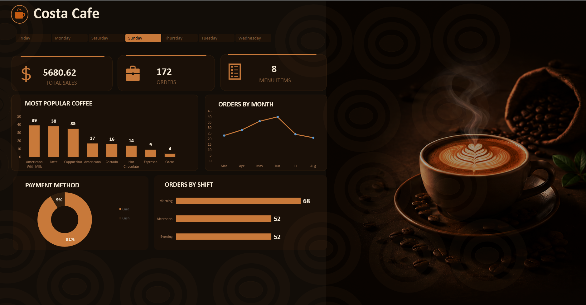

# ☕ Costa Cafe Sales Dashboard | Excel Project

## 📌 Project Overview

This project analyzes Costa Cafe sales data and transforms raw transactional data into actionable business insights through an interactive Excel Dashboard.

The dashboard enables stakeholders to monitor sales performance, customer purchasing behavior, payment preferences, and order distribution across different shifts and time periods.

---

## 🖼️ Dashboard Preview

<p align="center">
  
</p>

---

## 🎯 Project Objectives

* Analyze overall sales performance.
* Identify top-performing coffee products.
* Monitor monthly sales and order trends.
* Understand customer payment behavior.
* Evaluate order distribution across shifts.
* Support business decision-making through data visualization.

---

## 🛠️ Tools & Technologies

* Microsoft Excel
* Power Query
* Pivot Tables
* Pivot Charts
* Slicers
* Dashboard Design
* Data Visualization

---

## 🧹 Data Cleaning & Preparation

The dataset was cleaned and transformed using Power Query before analysis.

### Power Query

The following transformations were performed:

* Removed duplicate records.
* Checked and handled missing values.
* Standardized date formats.
* Removed extra spaces using Trim.
* Removed non-printable characters using Clean.
* Corrected inconsistent text values.
* Validated data types.
* Created calculated fields where required.

---

## 📈 Key Performance Indicators (KPIs)

The dashboard tracks the following KPIs:

* 💰 Total Sales
* 📦 Total Orders
* ☕ Menu Items
* 🏆 Most Popular Coffee

---

## 📊 Dashboard Features

### Sales Analysis

* Total Sales Overview
* Monthly Order Trends

### Product Analysis

* Most Popular Coffee Products
* Product Performance Comparison

### Payment Analysis

* Card vs Cash Transactions
* Customer Payment Preferences

### Shift Analysis

* Morning Orders
* Afternoon Orders
* Evening Orders

### Interactive Filtering

Users can dynamically filter dashboard results using slicers.

---

## 🎨 Dashboard Design Features

* Coffee-Themed Visual Design
* Interactive User Experience
* Dynamic Charts and KPIs
* Dark Mode Dashboard Layout

---

## 💡 Key Insights

* Americano with Milk is the best-selling coffee product.
* Card payments account for the majority of transactions.
* The Morning Shift generates the highest order volume.
* Monthly order volume fluctuates throughout the year.

---

## 🚀 Skills Demonstrated

* Data Cleaning
* Data Transformation
* Power Query
* Dashboard Design
* KPI Development
* Business Intelligence Reporting
* Data Visualization
* Analytical Thinking

---

## 📁 Repository Structure

```text
Costa-Cafe-Dashboard/
│
├── Dataset
├── Dashboard
├── Screenshots
│   └── dashboard.png
└── README.md
```

---

## 🔗 Connect With Me

### Portfolio

🌐 https://naguib5.github.io/

### LinkedIn

💼 https://www.linkedin.com/in/naguib-mousa-a9719b220/

### GitHub

💻 https://github.com/Naguib5

---

⭐ If you found this project interesting, feel free to give it a star.
